### 1. What is JavaScript?

- JavaScript (JS) is the most popular lightweight scripting and compiled programming language.
- It was developed by Brendan Eich in 1995.
- It is well-known as a scripting language for web pages, mobile apps, web servers, and many more.

### 2. What is the `this` keyword in JavaScript?

- Functions in JavaScript are essential objects. Like objects, it can be assign to variables, pass to other functions, and return from functions. And much like objects, they have their own properties.
- `this` stores the current execution context of the JavaScript program. Thus, when it use inside a function, the value of ‘this’ will change depending on how the function is defined, how it is invoked, and the default execution context.

### 3. What are the keywords used to declare a variable in JavaScript?

- In JavaScript, variables are declared using the keywords `var`, `let`, `const`.
- `var` is the original way to declare variables, while `let` and `const` were introduced in ES6.

### 4. What is ES6?

- ES6 (ECMAScript 6) is a version of JavaScript introduced in 2015.
- It has many new features such as fat arrow functions, constant declarations with a single keyword, modules, classes, spread operators, new methods with different types of literals, and primitive data types.

### 5. What are JavaScript Data Types?

- There are three major Data types in JavaScript.

  - Primitive

    - Numbers
    - Strings
    - Boolean
    - Symbol

  - Trivial

    - Undefined
    - Null

  - Composite

    - Objects
    - Functions
    - Arrays

### 6. What are the differences between `null` and `undefined`?

| Null                                                          | Undefined                                                                     |
| ------------------------------------------------------------- | ----------------------------------------------------------------------------- |
| It represents the intentional absence of a value.             | It represents the missing or uninitialized value.                             |
| It is an assignable value.                                    | It is automatically assigned to a variable or object that is not initialized. |
| It is a primitive value in JavaScript.                        | It was introduced in ECMAScript1 (ES1).                                       |
| `typeof` operator returns `object`.                           | `typeof` operator returns `undefined`.                                        |
| During arithmetic operations, null is converted to `Zero(0)`. | While performing arithmetic operations, `undefined` is converted to `NaN`.    |

### 7. What is the difference between ViewState and SessionState?

- **ViewState**: It is specific to a single page in a session.
- **SessionState**: It is user specific that can access all the data on the web pages.

### 8. What is JavaScript Engine?

- **JavaScript Engine** is simply a computer program that executes JavaScript code.
- It's responsible for translating human-readable JavaScript code into machine-readable instructions that the computer's hardware can execute.

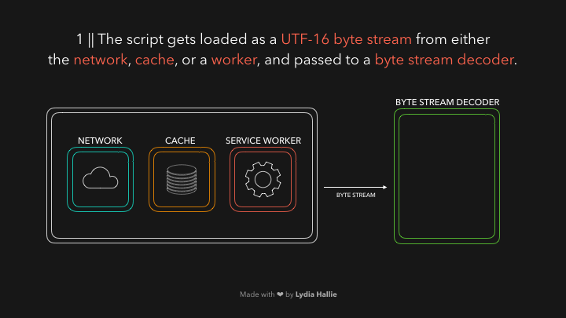

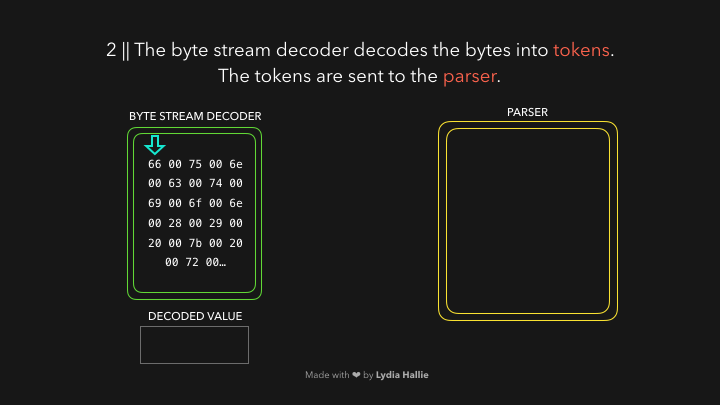

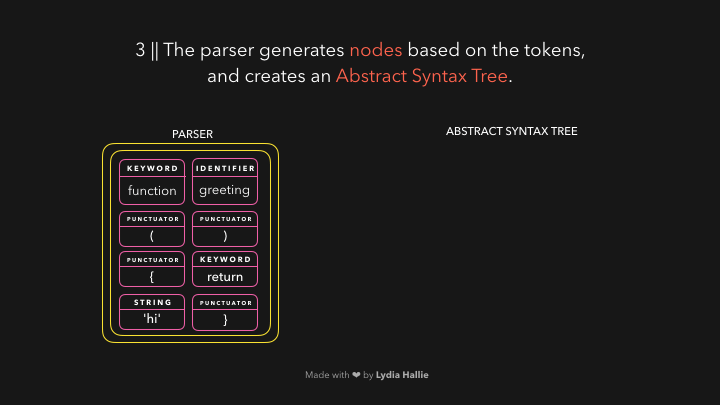


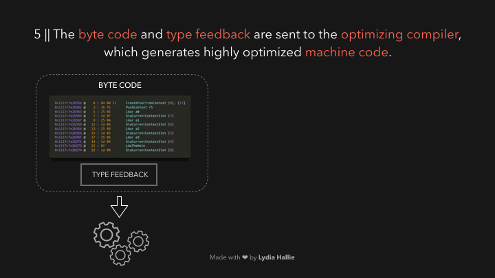

- For example:

```js
function sum(a + b) {
 return a + b;
}

sum(1, 2);

// This returns the number 3! The next time we invoke it, it will assume that we’re invoking it again with two numerical values.

// If that’s true, no dynamic lookup is required, and it can just re-use the optimized machine code. Else, if the assumption was incorrect, it will revert back to the original byte code instead of the optimized machine code.
```

- [Source from Lydia Hallie](https://dev.to/lydiahallie/javascript-visualized-the-javascript-engine-4cdf)

### 9. What is JavaScript Event Loop?

- **JavaScript Event Loop** is a fundamental mechanism that enables the asynchronous execution of code.
- It’s an essential part of the JavaScript runtime environment, allowing the language to handle non-blocking operations efficiently.
- The event loop is responsible for managing the execution of code, handling events, and maintaining the flow of control.


- For example:

```js
const foo = () => console.log("First");
const bar = () => setTimeout(() => console.log("Second"), 500);
const baz = () => console.log("Third");

bar();
foo();
baz();
```


- [Source from Lydia Hallie](https://dev.to/lydiahallie/javascript-visualized-event-loop-3dif)

### 10. What is JavaScript Promises & Async/Await?

- **Promise** is an object representing intermediate state of operation which is guaranteed to complete its execution at some point in future.

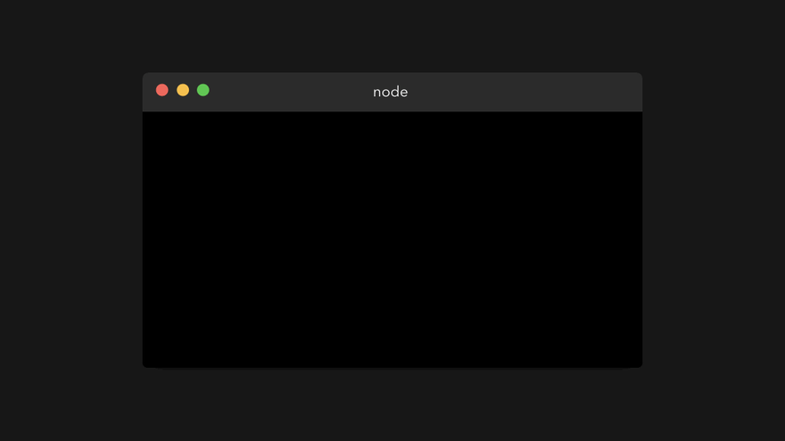

- For example:

```js
function getImage(file) {
  return new Promise((resolve, reject) => {
    try {
      const data = readFile(file);
      resolve(data);
    } catch (error) {
      reject(new Error(error));
    }
  });
}
```

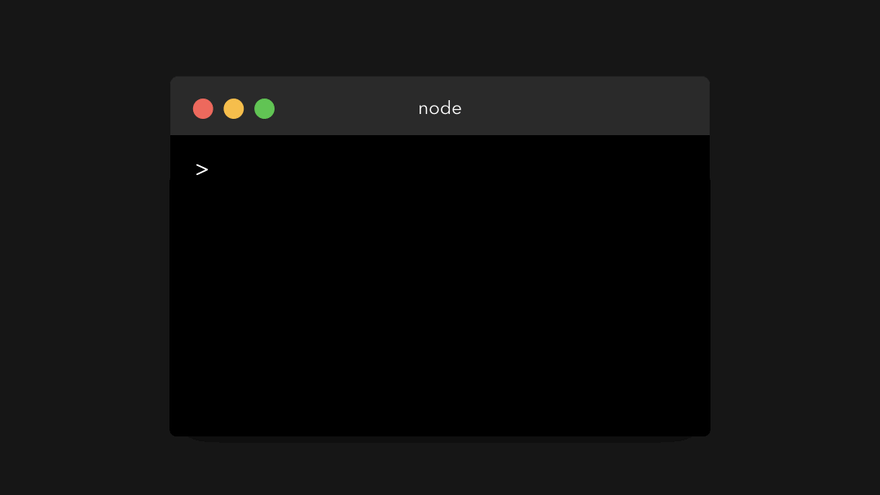

- To a promise, we can attach 3 methods:

  - `.then()`: Gets called after a promise resolved.
  - `.catch()`: Gets called after a promise rejected.
  - `.finally()`: Always gets called, whether the promise resolved or rejected.

- For example:

```js
getImage(file)
  .then((image) => console.log(image))
  .catch((error) => console.log(error))
  .finally(() => console.log("All done!"));
```


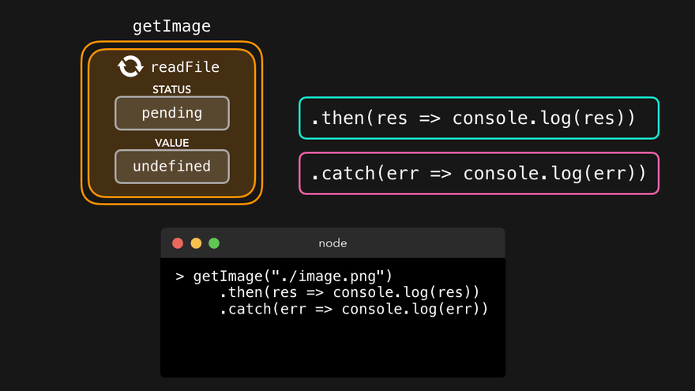

- **Async/Await** is a syntactic sugar for promises, a wrapper making the code execute more synchronously.

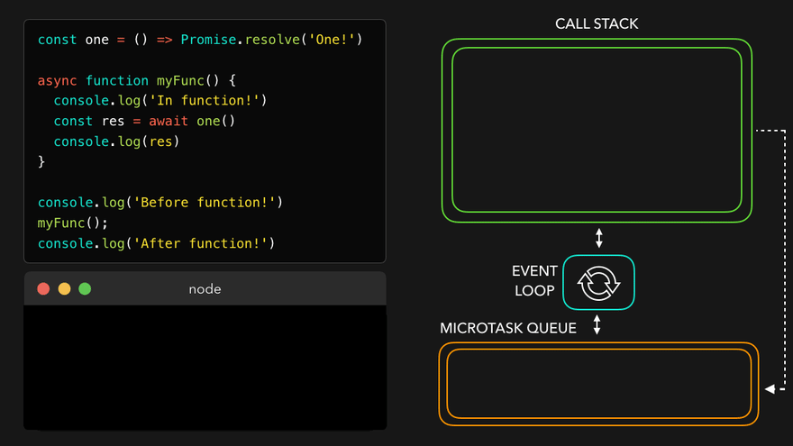

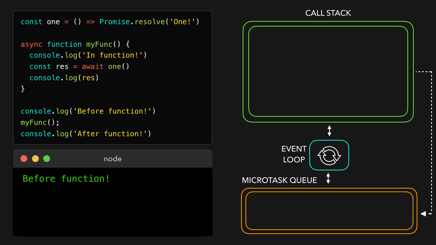

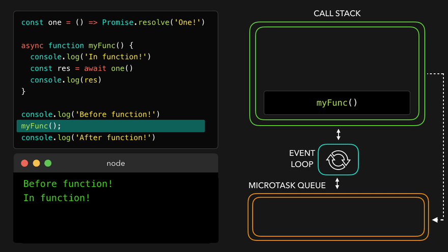

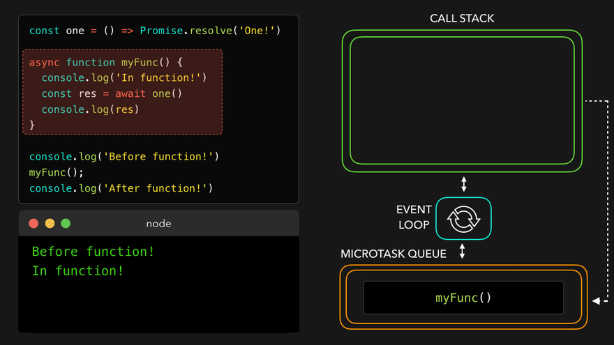


- [Source from Lydia Hallie](https://dev.to/lydiahallie/javascript-visualized-promises-async-await-5gke)

### 11. How many ways an HTML element can be accessed in JavaScript code?

- There are four possible ways to access HTML elements in JavaScript which are:

  - `getElementById()`: It is used to get the element by its id name.
  - `getElementsByClass()`: It is used to get all the elements that have the given classname.
  - `getElementsByTagName()`: It is used to get all the elements that have the given tag name.
  - `querySelector()`: This function takes CSS style selector and returns the first selected element.

### 12. What is the ‘Strict’ mode in JavaScript and how can it be enabled?

- Strict Mode is a new feature in ECMAScript 5 that allows you to place a program or a function in a `strict` operating context.
- This `strict` context prevents certain actions from being taken and throws more exceptions.
- The statement `use strict` instructs the browser to use the Strict mode, which is a reduced and safer feature set of JavaScript.
